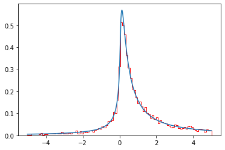

# LSTABLE library

LSTABLE is a Python library designed to sample trajectories and calculate theoretical features (density,characteristic function...) and display
- Stable distributions.
- $-\alpha$stable Lévy process.
- Classical Tempered Stable (CTS) Lévy processes.

---

## Installation

```bash
pip install LSTABLE


## Code Environment

To use the Levy library effectively, ensure you have the following environment setup:

- **Python Version**: Python 3.8 or newer
- **Dependencies**:
  - `numpy` (Numerical computations)
  - `matplotlib` (Visualizations)
  - `scipy` (Scientific computations)

Install the required dependencies using the following command:

```bash
pip install numpy matplotlib scipy


## Examples

### Sampling stable distribution

The following example demonstrates how to sample an $S_\alpha(\sigma,\beta,\mu)$

```python

# Parameters
alpha= 1.5 #stability index
sigma= 1 #
beta= 1.5 #
mu= 0 # 
n_sample=1000 #lenght of the sample

sample = stable_distribution_generator(
	alpha, sigma, beta, mu, n_sample
	)


# Compute the density
grid= np.linspace(-10,10,1E5)
density = stable_density(
	grid ,alpha , sigma, beta, mu
	)


### Output Figure

- **Sample Stable Distributions**:  
    
  *This figure visualizes a histogram of a sample of $S_\alpha(\sigma,\beta,\mu)$ and the corresponding density function computed using a Fourier Inverse formula.*


