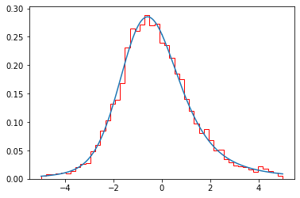
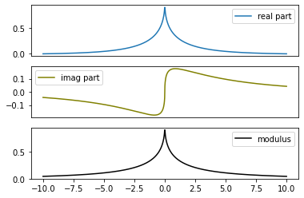
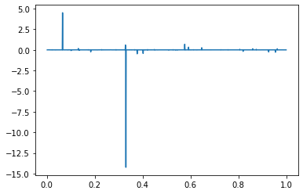
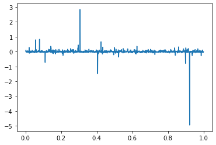
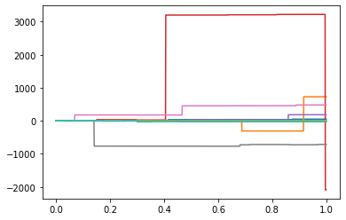
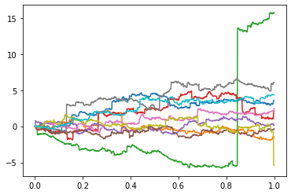
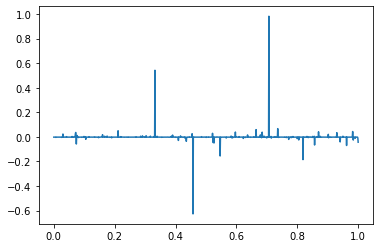
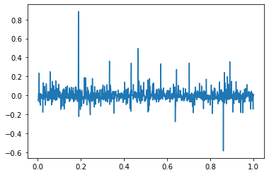
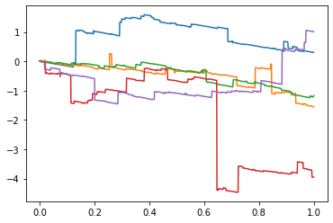
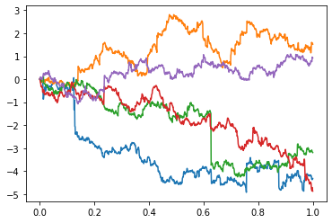

# LSTABLE library

LSTABLE is a Python library designed to sample trajectories calculate theoretical features (density, characteristic function...), and display
- Stable distributions.
- $\alpha-$stable Lévy process.
- Classical Tempered Stable (CTS) Lévy processes.
---

## Installation

```bash
pip install LSTABLE

```


## Code Environment

To use the Levy library effectively, ensure you have the following environment setup:

- **Python Version**: Python 3.8 or newer
- **Dependencies**:
  - `numpy` (Numerical computations)
  - `matplotlib` (Visualizations)
  - `scipy` (Scientific computations)

Install the required dependencies using the following command:

```bash
pip install numpy matplotlib scipy
```

## Examples

### Stable Parameters 

The following examples demonstrate how to check the validity of the stable parameters and how to convert from the $1-$parameterization to the Lévy parameters (drift,0,$\nu$) where $\nu(dx) = Px^{-1-\alpha} \mathbb{1}_{x>0} + Q|x|^{-1-\alpha} \mathbb{1}_{x<0}.$

```python
# Check the validity of stable parameters
valid_stable_parameters(
	alpha, sigma, beta, mu
	)

# Convert from (alpha,sigma,beta,mu) to the Lévy parameters (alpha,P,Q,drift) (P,Q are the positive/negative jump parameters of the Lévy measure
alpha,P,Q = stable_to_levy_parameter(
	alpha, P, Q, drift
	)
```

### Sampling stable distribution

The following example demonstrates how to sample an $S_\alpha(\sigma,\beta,\mu)$

```python

# Parameters
alpha= 1.5 #stability index
sigma= 2.0 #
beta= 0.5 #
mu= 0.0 # 
n_sample=10000 # length of the sample

sample = stable_distribution_generator(
	alpha, sigma, beta, mu, n_sample
	)


# Compute the density
grid= np.linspace(-7,7,1000)
density = stable_density(
	grid ,alpha , sigma, beta, mu
	)
```

#### Output Figure

- **Sample Stable Distributions**:  
  
  
  
  *This figure visualizes a histogram of 10000 values of $S_\alpha(\sigma,\beta,\mu)$ with alpha=0.5,1.5 and the corresponding density function computed using a Fourier Inverse formula.*

### Characteristic functions

The following example demonstrates how to compute the characteristic function of $S_\alpha(\sigma,\beta,\mu)$

```python
grid = np.linspace(-10,10,1000)
cf_stable= stable_characteristic_function(
	grid, alpha ,sigma ,beta , mu
	)
```
#### Output Figure

- **Stable characteristic function**:  
  
  
  
  *This figure visualizes the real, imaginary part and the modulus of the characteristic function of $S_\alpha(\sigma,\beta,\mu)$ with alpha=0.5,1.5. *


### $\alpha-$stable Lévy process

The following example demonstrates how to sample an $\alpha-$stable Lévy process with triplet (drift,0,$\nu$) an where 
$$\nu(dx) = Px^{-1-\alpha} \mathbb{1}_{x>0} + Q|x|^{-1-\alpha} \mathbb{1}{x<0}$$

```python
#Lévy parameters
P,Q= 2,1
drift=0.0

n = 10000 #number of observation
Delta= 0.0001 #observation rate
time_grid = np.linspace(Delta,n*Delta,n)
nb_sample = 1

#increments generation
increments=increment_stable_levy_process_generator(n, Delta,alpha, P, Q, drift, nb_sample)[0] #increment is of shape (nb_sample,n)
```
#### Output Figure

- **$\alpha-$stable Lévy process increments**:  
  
  
  
  *This figure visualizes the increments of $\alpha-$stable Lévy processes with index $\alpha=0.5,1.5$. *


```python
#Lévy parameters
P,Q= 2,1
drift=0.0

n = 10000 #number of observation
Delta= 0.0001 #observation rate
time_grid = np.linspace(0,n*Delta,n+1)
nb_sample = 10

#trajectory generation
trajectories = trajectory_stable_Levy_process_generator(n, Delta,alpha, P, Q, drift, nb_sample)
```

#### Output Figure

- **$\alpha-$stable Lévy process trajectories**:  
  
  
  
  *This figure visualizes 10 trajectories of $\alpha-$stable Lévy processes with index $\alpha=0.5,1.5$. *


### Classical Tempered Stable process via Bauemer-Merschaert algorithm.

The following example demonstrates how to sample a Classical Tempered Stable Lévy process with the triplet (drift,0,$\tilde{\nu}$) and where 
$$\nu(dx) = Pe^{-Ax}x^{-1-\alpha} \mathbb{1}_{x>0} + Qe^{-Bx}|x|^{-1-\alpha} \mathbb{1}{x<0}$$

```python
#Parameter
n_increments,Delta = 1000,0.001
alpha= 0.5 #1.5
P,Q=2,1
A,B=1,1
drift=0
c=1 #approximation parameter when $\alpha>=1$

#increments generation
increments= increments_CTS_generator(
    n_increment, Delta, alpha, 
    P, Q, A, B, drift, 
    c, verbose=False)


#trajectory generation
n_trajectories=5
trajectory_matrix=trajectory_CTS_generator(
    n_increment, n_trajectories, Delta, alpha, 
    P, Q, A, B, drift, 
    c, verbose=False)
```

- **CTS Lévy process increments**:  
  
  
  
  *This figure visualizes increments of CTS Lévy processes with index $\alpha=0.5,1.5$. *
  
- **CTS Lévy process trajectories**:  
  
  
  
  *This figure visualizes 5 trajectories of CTS Lévy processes with index $\alpha=0.5,1.5$. *
