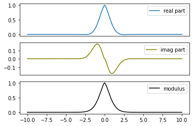
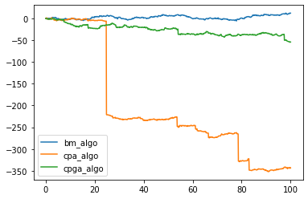
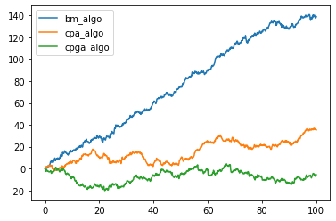
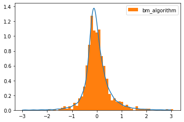
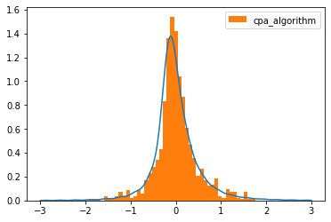
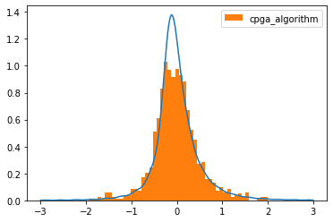
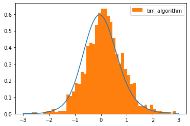
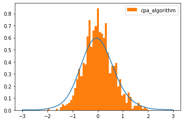
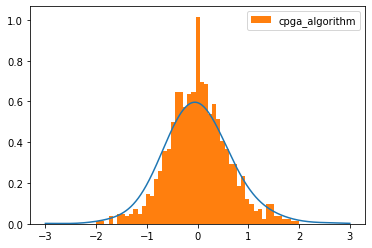

# LSTABLE library

LSTABLE is a Python library designed to sample trajectories calculate theoretical features (density, characteristic function...), and display
- Stable distributions.
- $\alpha$-stable Lévy process.
- Classical Tempered Stable (CTS) Lévy processes.
---

## Mathematical references
This library follows the review article: T.Jalal [**"Stable and tempered stable distributions and processes: an overview toward trajectory simulation"**](https://arxiv.org/abs/2412.06374). 

## Installation

```bash
pip install LSTABLE

```


## Code Environment

To use the Levy library effectively, ensure you have the following environment setup:

- **Python Version**: Python 3.8 or newer
- **Dependencies**:
  - `numpy` (Numerical computations)
  - `matplotlib` (Visualizations)
  - `scipy` (Scientific computations)

Install the required dependencies using the following command:

```bash
pip install numpy matplotlib scipy
```

## Examples
$\alpha \beta \gamma \epsilon \mu \nu \chi$
### Stable Parameters 

The following examples demonstrate how to check the validity of the stable parameters and how to convert from the $1-$parameterization to the Lévy parameters (drift , 0 , $\nu$) where $\nu(dx) = Px^ {-1- \alpha} \mathbb{1}_ { x>0 } + Q |x|^ {-1 - \alpha} \mathbb{1}_ {x<0}$.

```python
# Check the validity of stable parameters
valid_stable_parameters(
	  alpha, sigma, beta, mu
)

# Convert from (alpha,sigma,beta,mu) to the Lévy parameters (alpha,P,Q,drift) (P,Q are the positive/negative jump parameters of the Lévy measure
alpha, P, Q = stable_to_levy_parameter(
	  alpha, P, Q, drift
)
```

### Sampling stable distribution

The following example demonstrates how to sample an $S_\alpha(\sigma,\beta,\mu)$

```python

# Parameters
alpha = 1.5  # stability index
sigma = 2.0
beta = 0.5
mu = 0.0
n_sample = 10000 # length of the sample

sample = stable_distribution_generator(
    alpha, sigma, beta, mu, n_sample
)


# Compute the density
grid = np.linspace(-7, 7, 1000)
density = stable_density(
	  grid ,alpha , sigma, beta, mu
)
```

#### Output Figure

- **Sample Stable Distributions**:  
  
  
  
  *This figure visualizes a histogram of 10000 values of $S_\alpha(\sigma,\beta,\mu)$ with alpha=0.5,1.5 and the corresponding density function computed using a Fourier Inverse formula.*

### Characteristic functions

The following example demonstrates how to compute the characteristic function of $S_\alpha(\sigma,\beta,\mu)$

```python
grid = np.linspace(-10, 10, 1000)
cf_stable = stable_characteristic_function(
	  grid, alpha ,sigma ,beta, mu
)
```
#### Output Figure

- **Stable characteristic function**:  
  
  
  
  *This figure visualizes the real, imaginary part and the modulus of the characteristic function of $S_\alpha(\sigma,\beta,\mu)$ with alpha=0.5,1.5. *


### $\alpha$-stable Lévy process

The following example demonstrates how to sample an $\alpha-$stable Lévy process with triplet (drift,0,$\nu$) an where 
$$\nu(dx) = Px^ {-1- \alpha} \mathbb{1}_ { x>0 } + Q |x|^ {-1 - \alpha} \mathbb{1}_ {x<0}$$

```python
# Lévy parameters
P, Q = 2,1
drift = 0.0

n = 10000  # number of observation
Delta = 0.0001  # observation rate
time_grid = np.linspace(Delta, n*Delta, n)
nb_sample = 1

# increments generation
increments = increment_stable_levy_process_generator(n, Delta,alpha, P, Q, drift, nb_sample)[0] #increment is of shape (nb_sample,n)
```
#### Output Figure

- **$\alpha$-stable Lévy process increments**:  
  
  
  
  *This figure visualizes the increments of $\alpha-$stable Lévy processes with index $\alpha =0.5,1.5$. *


```python
# Lévy parameters
P, Q = 2, 1
drift = 0.0

n = 10000  # number of observation
Delta = 0.0001  # observation rate
time_grid = np.linspace(0, n*Delta, n+1)
nb_sample = 10

# trajectory generation
trajectories = trajectory_stable_Levy_process_generator(n, Delta,alpha, P, Q, drift, nb_sample)
```

#### Output Figure

- **$\alpha$-stable Lévy process trajectories**:  
  
  
  
  *This figure visualizes 10 trajectories of $\alpha-$stable Lévy processes with index $\alpha =0.5,1.5$. *

## Classical Tempered Stable process sampling
The following example demonstrates how to sample a Classical Tempered Stable Lévy process with the triplet (drift,0,$\tilde{\nu}$) and where 
$$\nu(dx) = P e^ {-Ax}  x^ {-1- \alpha} \mathbb{1}_ { x>0 } + Q e^ {-Bx} |x|^ {-1 - \alpha} \mathbb{1}_ {x<0}$$

| name  | method          | loading_bar |
| :---------------: |:---------------:|:-------------:|
| 'bm'  |  Bauemer-Merschaert     | displays progressive bar of n the number of increments  |
| 'cpa'  | Compound Poisson approximation           |   number of jumps sampled |
| 'cpag'  | Compound Poisson approximation with Gaussian approximation of the small jumps         |  number of sampled jump |

** The Baumer-Merchaert is by far the most efficient algorithm it term of time an accuracy. Use it by default **

```python
# Parameter
n_increments,Delta = 1000,0.001
alpha = 0.5  # 1.5
P,Q = 2,1
A,B = 1,1
drift = 0
delta = 0.1  # jump size of the compound Poisson approximation
```

### Classical Tempered Stable process via Compound Poisson approximation and gaussian approximation of small jumps.

The following example demonstrates using a Compound Poisson approximation (truncating the jump at a threshold $\delta$) and a Gaussian approximation of the small jumps (optional)

```python
# increments generation by Baumer_Merschaert method
increments_bm=tempered_stable_process_increments(
	n_increments ,
	Delta ,drift
	drift ,
	alpha,
	P,
	Q,
	A,
	B,
	delta,
	loading_bar= False, 
	method='bm')
# increments generation by compound Poisson approximation
increments_cpa=tempered_stable_process_increments(
	n_increments ,
	Delta ,drift
	drift ,
	alpha,
	P,
	Q,
	A,
	B,
	delta,
	loading_bar= False, 
	method='cpa')


# increments generation by compound Poisson approximation and gaussian approximation of the small jumps
increments_cpga=tempered_stable_process_increments(
	n_increments ,
	Delta ,drift
	drift ,
	alpha,
	P,
	Q,
	A,
	B,
	delta,
	loading_bar= False, 
	method='cpga')

```
- **CTS Lévy process trajectories with 'bm' method**:  
  
  
  
  *This figure visualizes trajectories using the three methods for $n=1000$, $\Delta =0.1$ and $\alpha = 0.8, 1.5$ . *
  
- **CTS Lévy process accuracy for alpha=0.8**:  
  
  
  

- **CTS Lévy process accuracy for alpha=1.5**:  
  
  
  
  
  *This figure visualizes the accuracy of the sampling by plotting the histogram against the theoretical density of the algorithm. *

## Development

### formating
use black to format your files
```bash
poetry run black .
```
